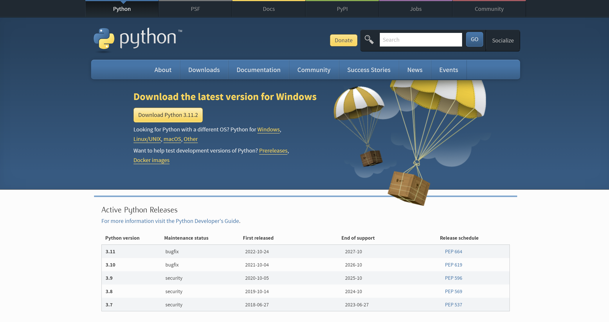
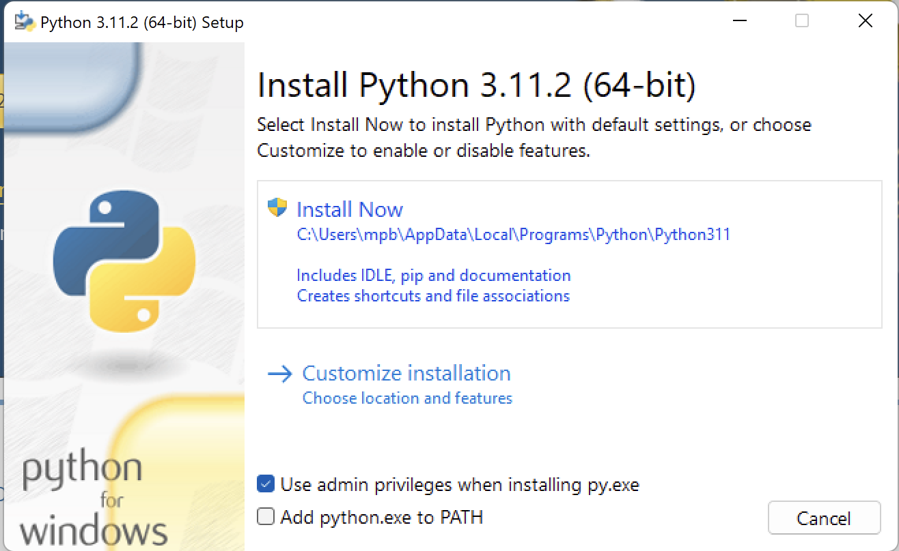
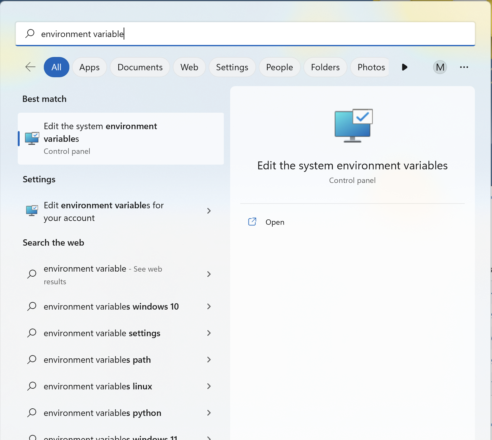
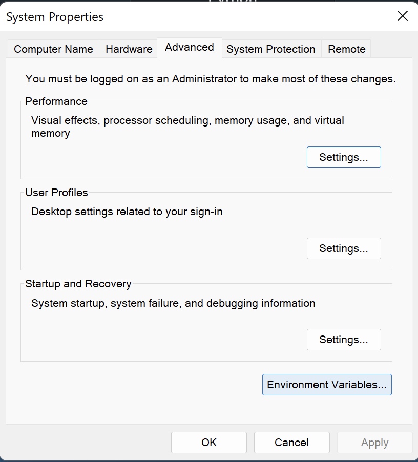
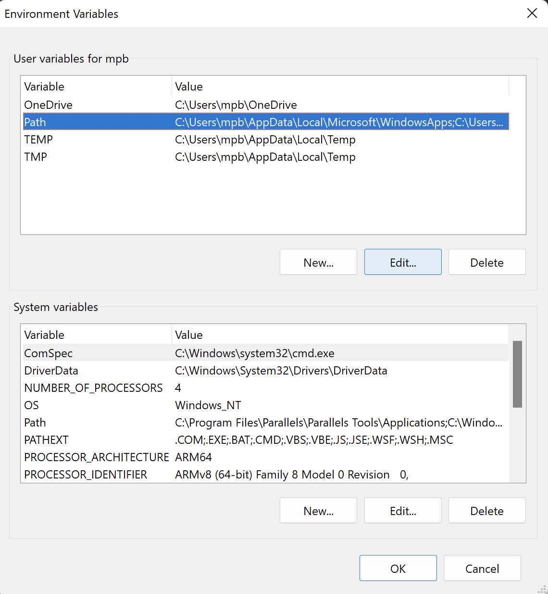
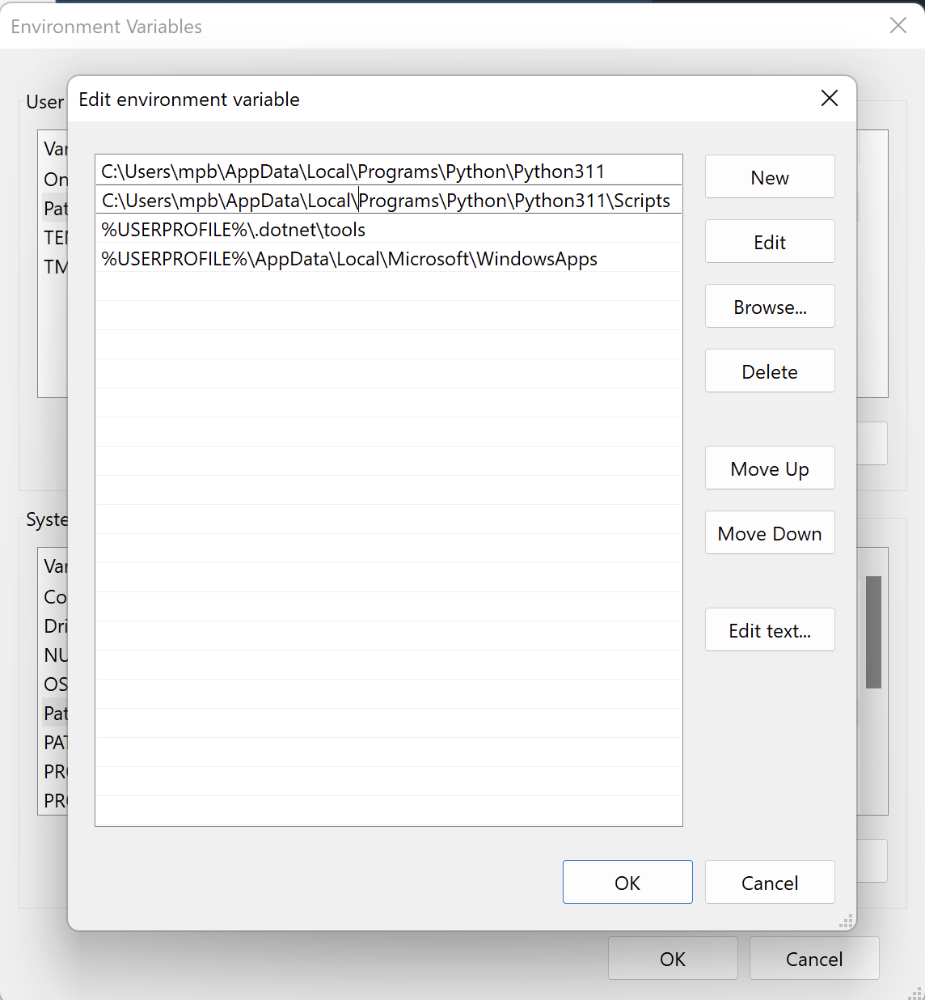
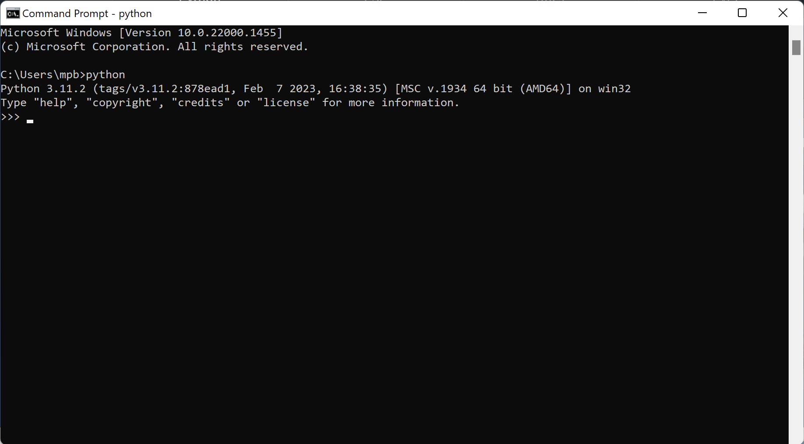
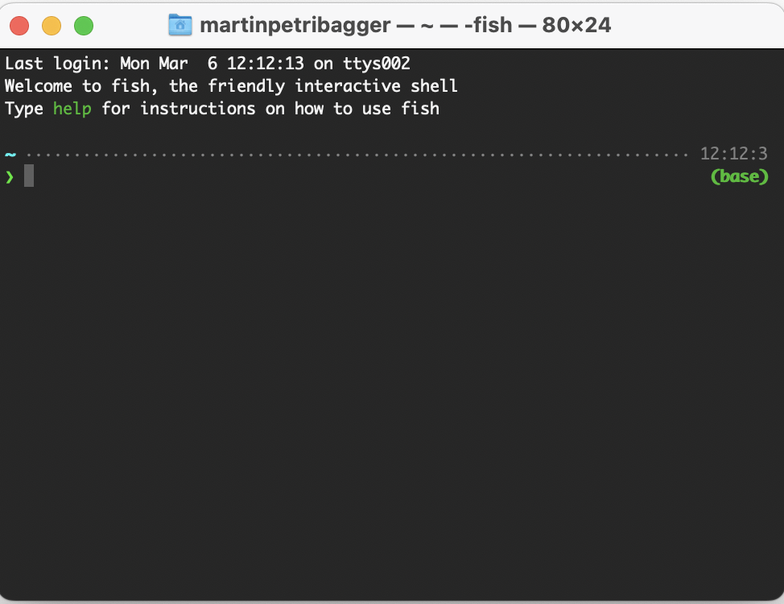

# Getting started with python

In this course you will be using python. In order to follow the lectures you will need to do the following before the first class on python programming:

- **install python** - you can either use one of the many online guides or the one below ([for windows](## install python on windows) or [for mac](##install python on mac))

- **install poetry** - use the [guide below](##install poetry)

- (optionally) download and install **vs code** from [here](https://code.visualstudio.com/download) - *I will be working from vs code*

  

## install python on windows

1. Download python to your computer [here](https://www.python.org/downloads/windows/):

   

2. Install python by running the downloaded exe-file:

   


​	Install python in the default location which should be: 

​	`C:\Users\<YOUR USER>\AppData\Local\Programs\Python\Python<PYTHON VERSION>`


3. Set “Python37” path and “Python37/Scripts” path to environment variable.

   1. From the start menu search for “environment variable” and click “Edit the system environment variables” 

      ​	

      

       

   2. Click "Environment variables": 

      

      

   3. Mark "Path" under "User variables for [`Your USER`]" and click on “Edit”

      

      

   4. Click on New and paste the path to the python.exe in your system which should be placed during installation at this destination:

      `C:\Users\<YOUR USER>\AppData\Local\Programs\Python\Python<PYTHON VERSION>`

      

   5. Click on New and paste the path to: 

      `C:\Users\<YOUR USER>\AppData\Local\Programs\Python\Python<PYTHON VERSION>\Scipts`

      

   6. Make sure to keep your python above the windows app (if exists). Use the arrows to direct your python above the Microsoft.

      

      

4. Check the installation.

   1. Open command prompt (go to the start menu in windows and search for cmd)	

   1. Type `python` and validate you see the following:


   


## install python on mac

1. Xcode is Apple's Integrated Development Environment (IDE). You might already have Xcode on your Mac. If not, you can get Xcode from Apple appstore. [Xcode](https://itunes.apple.com/us/app/xcode/id497799835?mt=12&ls=1)
2. Open a terminal window



3. Install HomeBrew

   `/bin/bash -c "$(curl -fsSL https://raw.githubusercontent.com/Homebrew/install/HEAD/install.sh)"`

4. Install python 3

   `brew install python3`


## install poetry

If you are using a Windows system, you will have to use **Windows (Powershell)** to install poetry. 

1. search for and select Windows PowerShell

   

2. In the PowerShell prompt you paste the following:

   ```powershell
   (Invoke-WebRequest -Uri https://install.python-poetry.org -UseBasicParsing).Content | py -	
   ```


If you are using **Linux, macOS or Windows (WSL)** 

1. go to the terminal or command prompt and run the following command:

   ```bash
   curl -sSL https://install.python-poetry.org | python3 -
   ```

   

Check if you have access to poetry by running the command 

```bash
poetry --version
```

If you see something like `Poetry (version 1.8.0)`, your install is ready to use!


*For further reference and issues, please look at the official documentation that you can find [here](https://python-poetry.org/docs/#installing-with-the-official-installer).*