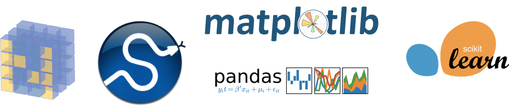

## What is python

[Python](http://www.python.org/) is a modern, general-purpose, object-oriented, high-level programming language.

General characteristics of Python:

* **simple and clean:** Python code is easy-to-read and intuitive, has easy-to-learn minimalistic syntax, and maintainability scales well with size of projects.
* **expressive language:** Fewer lines of code, fewer bugs, easier to maintain.

Technical details:

* **dynamically typed:** No need to define the type of variables, function arguments or return types.
* **automatic memory management:** No need to explicitly allocate and deallocate memory for variables and data arrays. No memory leak bugs. 
* **interpreted:** No need to compile the code. The Python interpreter reads and executes the python code directly.

Advantages:

* The main advantage is ease of programming, minimizing the time required to develop, debug and maintain the code.
* Well designed language that encourage many good programming practices:
 * Modular and object-oriented programming, good system for packaging and re-use of code. This often results in more transparent, maintainable and bug-free code.
 * Documentation tightly integrated with the code.
* A large standard library, and a large collection of add-on packages.

Disadvantages:

* Since Python is an interpreted and dynamically typed programming language, the execution of python code can be slow compared to compiled statically typed programming languages, such as C and Fortran. 
* Somewhat decentralized, with different environment, packages and documentation spread out at different places. Can make it harder to get started.

## Popular Language for Data Analysis

Most of the time, you will need external packages to asist data analyses.



## The Zen of Python


```python
import this
```

    The Zen of Python, by Tim Peters
    
    Beautiful is better than ugly.
    Explicit is better than implicit.
    Simple is better than complex.
    Complex is better than complicated.
    Flat is better than nested.
    Sparse is better than dense.
    Readability counts.
    Special cases aren't special enough to break the rules.
    Although practicality beats purity.
    Errors should never pass silently.
    Unless explicitly silenced.
    In the face of ambiguity, refuse the temptation to guess.
    There should be one-- and preferably only one --obvious way to do it.
    Although that way may not be obvious at first unless you're Dutch.
    Now is better than never.
    Although never is often better than *right* now.
    If the implementation is hard to explain, it's a bad idea.
    If the implementation is easy to explain, it may be a good idea.
    Namespaces are one honking great idea -- let's do more of those!


## Variables

Vairables can be considered __containers__. You can put anything inside a container, __without specifying the size or type__, which will be needed in Java or C. 

Variable names are references to objects in memory.

Some basics in working with variables:
- Use meaningful variables names 
- Note that Python is case-sensitive. Be careful about using letters in different cases.
- Don't use python reserved keywords as variable names `help("keywords")`.


```python
help("keywords")
```

When assigning values, we put the variable to be assigned to on the left hand side (LHS), while the value to plug in on the RHS. LHS and RHS are connected by an equal sign (`=`), meaning assignment.


```python
x = 3 # integer
y = 3. # floating point number
z = "Hello!" # strings
Z = "Wonderful!" # another string, stored in a variable big z.
print(x)
print(y)
print(z)
print(Z)
```

    3
    3.0
    Hello!
    Wonderful!


## Naming convention

There are two commonly used style in programming:

1. __camelCase__
2. __snake_case__ or __lower_case_with_underscore__

Please look into the pep8 under [naming conventions](https://peps.python.org/pep-0008/#naming-conventions) for more information.

## `print()`

The print statement can print zero, one, or more values.
  
Default behavior
- print a space between values
- print a line break after printing all values
- Default behavior can be changed by keyword arguments ”sep” and ”end”


```python
print()

print(1)

print(2, 'Hello')

print("a", "b", 3)

print("c", "d", 4, sep=':')

print(5);print(6)

print(7, end=', ');print(8)
```

## `help(…)`

The help function gives you info any module, keyword, or topic


```python
help(print)
```

    Help on built-in function print in module builtins:
    
    print(*args, sep=' ', end='\n', file=None, flush=False)
        Prints the values to a stream, or to sys.stdout by default.
        
        sep
          string inserted between values, default a space.
        end
          string appended after the last value, default a newline.
        file
          a file-like object (stream); defaults to the current sys.stdout.
        flush
          whether to forcibly flush the stream.
    


## Whitespace Formatting

Many languages use curly braces to delimit blocks of code. Python uses indentation (four spaces):


```python
for i in [1, 2]:
    print(i)                    # first line in "for i" block
    for j in [3, 4]:
        print(j)                # first line in "for j" block
        print(i + j)            # last line in "for j" block
    print(i)                    # last line in "for i" block
print("done looping")
```

    1
    1
    2
    2
    3
    3
    4
    4
    5
    5
    6
    1
    2
    1
    3
    2
    4
    3
    5
    4
    6
    5
    7
    2
    3
    1
    4
    2
    5
    3
    6
    4
    7
    5
    8
    3
    4
    1
    5
    2
    6
    3
    7
    4
    8
    5
    9
    4
    5
    1
    6
    2
    7
    3
    8
    4
    9
    5
    10
    5
    done looping


## Notebooks

###### Basics
1. [Strings](basic/01_strings.ipynb)
2. [Numbers](basic/02_numbers.ipynb)
3. [Lists](basic/03_lists.ipynb)
4. [Dictionaries](basic/04_dictionaries.ipynb)
5. [Conditionals](basic/05_conditionals.ipynb)
6. [For loops](basic/06_for_loops.ipynb)
   
###### Extended
1. [File_io](basic/07_file_io.ipynb)
2. [Functions](basic/08_functions.ipynb)
   
###### Data
1. [API's](date_retrieval/01_APIs.ipynb)
1. [Scraping](date_retrieval/02_scraping.ipynb)
1. [Introducing pandas](data_processing/01_pandas_intro.ipynb)
1. [Data Cleaning](data_processing/02_basic_data_cleaning.ipynb)
1. [Preprocessing](data_processing/04_data_preprocessing.ipynb)
<!-- 1. [Basic NLP](data_processing/03_basic_NLP.ipynb)
1. [Sentiment Analysis](data_processing/06_Sentiment_Analysis.ipynb)
1. [Topic Modelling](data_processing/05_Topic_Modelling.ipynb) -->

###### Excercises 
1. [Strings](exercises/strings_exercise.ipynb)
2. [Numbers](exercises/numbers_exercise.ipynb)
3. [Lists](exercises/lists_exercise.ipynb)
4. [Dictionaries](exercises/dictionaries_exercise.ipynb)
5. [Conditionals](exercises/conditionals_exercise.ipynb)
6. [For loops](exercises/for_loops_exercise.ipynb)
7. [File_io](exercises/file_io_exercise.ipynb)
   


